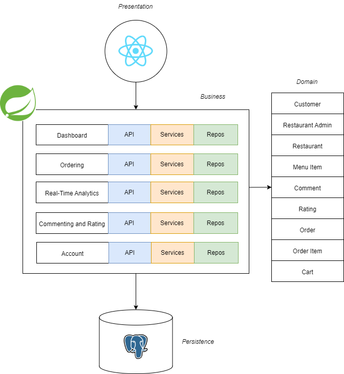

# COMP 4350 Proposal for Team Crave

### Summary and Vision

#### For Restaurants:
We want to give restaurants the information that they need to improve efficiency. Through the data we provide to restaurants,  they can streamline their operations by using data to predict peak hours, plan promotions and improve menus and offerings to better serve their users. Through comments, restaurants will be able to get feedback and improve their workflows. Overall, we hope that the data we make available to restaurants can help them make decisions that improve their operations. 

#### For consumers:
One of the main problems we aim to tackle with this application is maximizing user satisfaction through data. Through analyzing customer data such as past orders, preferences, and dietary restrictions, we want to give users recommendations that we know they want. Through analyzing restaurant data to identify top-performing dishes and menus among users with similar preferences, we plan to give users recommendations that they don't even know they want. Using data-driven applications,  we believe we can vastly improve the appeal of restaurants to users. 

### Technologies

| Front End       | Back End   | Database  | DevOps       |
|-----------------|------------|-----------|--------------|
| React           | Spring Boot| Postgres  | Docker       |
| React Bootstrap |            |           | Maven        |
|                 |            |           | Github Actions|

### Architecture

### Features
1. Account 
2. Dashboards
3. Comments and Ratings
4. Ordering
5. Real-Time Analytics

### User Stories
#### Account
- **As** a user, **I want to be able to** create a new account **so that** I can start ordering food.
- **As** a registered user, **I want to be able to** login to the application **so that** I can access my account and place orders.
- **As** a registered user, **I want to be able to** edit my account information such as my name, address, and phone number **so that** I can keep my personal details up to date.
- **As** a registered user, **I want to be able to** see my order history in my account **so that** I can keep track of my past orders.
- **As** a restaurant owner, **I want to be able to** manage my restaurant’s profile and menu details **so that** I can attract more customers.

#### Dashboards
- **As** a registered user, **I want to be able to** see the restaurants in my area, including their ratings and ordering times **so that** I can quickly decide where to order from.
- **As** a registered user, **I want to be able to** search for specific restaurants or cuisines directly from the dashboard **so that** I can quickly determine what I am craving. 
- **As** a registered user, **I want to be able to** access my recent orders **so that** I can track my order status from the dashboard.

#### Comments and Ratings
- **As** a registered user, **I want to be able to** leave comments and ratings for restaurants and food **so that** I can share my experience with other users.
- **As** a registered user, **I want to be able to** see the overall rating and the number of reviews for each restaurant **so that** I can make informed choices.

#### Ordering
- **As** a registered user, **I want to be able to** add items to my shopping cart **so that** I can track the items I want to purchase and proceed to checkout
- **As** a registered user, **I want to be able to** view my order history **so that** I can get recommendations of my preferred dishes
- **As** a registered user, **I want to be able to** place an order for pickup from a nearby restaurant **so that** I can get my food quickly while avoiding delivery bills
- **As** a registered restaurant admin, **I want to be able to** receive and decline orders **so that** I can manage restaurant operations efficiently

#### Real-Time Analytics
- **As** a registered user, **I want to be able to** see how popular particular restaurants and food items are in a different way from reviews **so that** I have more information to help decide on my order.
- **As** a registered user, **I want to be able to** know how busy a restaurant is at a glance, just like how I can tell by physically being at the restaurant location, **so that** I can know wait times at a glance.
- **As** a registered restaurant admin, **I want to be able to** know what items are being ordered in high volumes, **so that** I can manage stock and food prep more effectively.

### Contributors
| Name       			| Email   					| Github Username  	| Role				|
|-----------------------|---------------------------|-------------------|-------------------|
| Xiaoran (David) Meng	| mengx5@myumanitoba.ca		| 			  		|					|
| Koye Fatoki 			| fatokioo@myumanitoba.ca  	|           		|					|
| Eddie Wat        		| wate@myumanitoba.ca		|	          		|					|
| Jared Castillo        | castil13@myumanitoba.ca   |	           		|					|

### [Meetings](Meetings.md)
